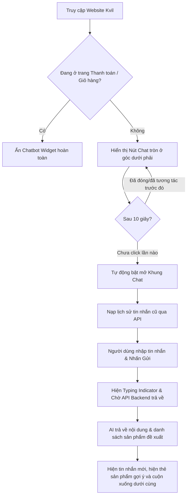

# Tài liệu Trợ lý Ảo Kvil AI (Chatbot AI UI/UX Documentation)

Tài liệu này mô tả chi tiết kiến trúc, các tính năng UI/UX và các quyết định thiết kế cho hệ thống **Chatbot AI (Kvil Assistant)** thuộc phần Frontend của cửa hàng thời trang Kvil.

Thư mục thành phần: [`src/components/user/chatbot/`](/Frontend/src/components/user/chatbot)

---

## 1. Tổng quan Kiến trúc UI/UX

Hệ thống chatbot được thiết kế theo phong cách hiện đại, tối giản (Sleek & Minimalist) với gam màu chủ đạo đen-trắng (`#1c1c19` và `white`), đồng bộ với bộ nhận diện thương hiệu cao cấp của Kvil. 

Để tối ưu hóa hiệu năng tải trang ban đầu, toàn bộ khung chat chính được **Lazy Load** và chỉ được nạp vào bộ nhớ khi người dùng click mở chatbot hoặc sau thời gian kích hoạt tự động.

---

## 2. Các Thành phần Giao diện & Trải nghiệm Người dùng (UX)

### A. Nút kích hoạt nổi (Floating Widget Trigger) - [`user.chatbot-widget.jsx`](/Frontend/src/components/user/chatbot/user.chatbot-widget.jsx)
* **Tự động kích hoạt (Auto-open Prompt):** Hệ thống tự động mở cửa sổ chat sau **10 giây** kể từ khi truy cập trang đầu tiên nhằm thu hút sự chú ý và tăng tương tác của khách hàng (chỉ kích hoạt một lần duy nhất).
* **Ẩn thông minh (Smart Dismissal):** Chatbot sẽ tự động ẩn đi (`opacity-0` và dịch chuyển xuống dưới) nếu:
  1. Người dùng đang ở các trang thanh toán/giỏ hàng (`/cart`, `/checkout`, `/order-success`, `/order/vnpay-return`).
  2. Drawer giỏ hàng mini bên phải đang được mở.
  *Điều này giúp tránh xung đột giao diện, tối ưu không gian hiển thị cho các hành động mua hàng quan trọng.*
* **Hiệu ứng chuyển động (Micro-animations):**
  * Nút có hiệu ứng phóng to/thu nhỏ nhẹ nhàng khi rê chuột (`scale-110`).
  * Khi mở khung chat, icon chuyển từ `MessageSquare` sang `X` đồng thời xoay 90 độ mượt mà (`rotate-90`).
  * Có dấu chấm thông báo màu đỏ nhảy động (`animate-bounce`) để nhắc nhở khách hàng khi chưa từng tương tác.

### B. Khung hội thoại chính (Chat Window) - [`user.chatbot-window.jsx`](/Frontend/src/components/user/chatbot/user.chatbot-window.jsx)
* **Phân trang Lịch sử thông minh (Facebook Messenger-Style):** Khi mở khung chat, hệ thống chỉ tải phần lịch sử tin nhắn mới nhất (mặc định 20 tin gần nhất) thay vì tải toàn bộ. Khi người dùng cuộn lên trên cùng (hoặc vuốt xuống), hệ thống tự động gọi API lấy thêm các tin nhắn cũ hơn.
* **Thanh tiêu đề (Premium Header):**
  * Avatar Chatbot chuyên nghiệp cùng trạng thái hoạt động với chấm xanh lá cây nhấp nháy động (`animate-pulse`).
  * Font chữ tiêu đề Lora Serif sang trọng.
  * Nút "Làm mới" (`RotateCcw`) giúp người dùng tải lại nhanh lịch sử chat.
* **Xử lý lỗi kết nối:** Nếu có lỗi tải lịch sử chat, khung hiển thị sẽ chuyển sang trạng thái báo lỗi với icon cảnh báo mờ, dòng chữ nhắc nhở và nút "Tải lại" tùy chỉnh.

### C. Danh sách tin nhắn (Message Body) - [`user.chatbot-body.jsx`](/Frontend/src/components/user/chatbot/user.chatbot-body.jsx)
* **Cuộn tự động (Auto-scroll):** Màn hình chat tự động cuộn xuống dưới cùng (`scrollTop = scrollContainer.scrollHeight`) bằng hiệu ứng mượt mà (`scroll-smooth`) mỗi khi có tin nhắn mới gửi từ user, bot phản hồi hoặc khi AI bắt đầu gõ (`isTyping = true`).
* **Tải lịch sử cuộn vô hạn (Infinite Scroll):** Khi cuộn hoặc vuốt lên đầu danh sách (`scrollTop <= 5`), hệ thống tự động tải trang lịch sử tiếp theo và hiển thị biểu tượng loading nhỏ phía trên cùng.
* **Bảo toàn vị trí cuộn (Scroll Position Preservation):** Thuật toán tự động đo lường chiều cao vùng chứa (`scrollHeight`) trước và sau khi tải tin nhắn cũ. Sau đó, nó tự động bù trừ khoảng chênh lệch chiều cao này vào `scrollTop` để giữ nguyên vị trí mắt đọc của người dùng, loại bỏ hiện tượng bị nhảy màn hình đột ngột khi tải dữ liệu cũ.
* **Hiệu ứng AI đang phản hồi (Typing Indicator):** Hiển thị bong bóng chat chứa 3 dấu chấm nhảy động (`animate-bounce`) tuần tự lệch pha để giả lập trải nghiệm Chatbot đang suy nghĩ thời gian thực.
* **Thanh cuộn vô hình:** Tự động ẩn thanh cuộn thô cứng của trình duyệt (`scrollbar-hide`) trên cả Chrome, Safari và Firefox nhằm giữ tính thẩm mỹ cao nhất.

### D. Bong bóng chat & Gợi ý sản phẩm - [`user.chatbot-message.jsx`](/Frontend/src/components/user/chatbot/user.chatbot-message.jsx)
* **Thiết kế đối xứng (Alternating Bubbles):**
  * Tin nhắn từ **Khách hàng (USER):** Avatar đen góc phải, bong bóng chat màu tối `#1c1c19` chữ trắng, bo góc lệch sang phải.
  * Tin nhắn từ **Chatbot (BOT):** Avatar xám góc trái, bong bóng chat màu trắng viền xám nhạt chữ tối, bo góc lệch sang trái.
* **Hiển thị thời gian:** Múi giờ định dạng 24h siêu nhỏ tinh tế bên dưới mỗi bong bóng tin nhắn.
* **Băng chuyền Gợi ý Sản phẩm (Product Cards Carousel):**
  * Khi AI đề xuất sản phẩm thời trang phù hợp, hệ thống sẽ render một dãy thẻ sản phẩm mini nằm ngang.
  * Hỗ trợ lướt ngang mượt mà bằng cử chỉ vuốt trên di động hoặc cuộn chuột, căn hàng tự động (`snap-x snap-start`).
  * Thẻ sản phẩm hiển thị ảnh đại diện bo góc, tên sản phẩm và hiệu ứng zoom ảnh nhẹ (`group-hover:scale-110`) kèm đổi màu chữ sang đen đậm khi tương tác.
  * Link điều hướng sản phẩm sử dụng cơ chế bảo mật ID bằng cách băm mã hóa (`encodeId`) và tạo đường dẫn thân thiện SEO (`slugify`).

### E. Hộp nhập liệu thông minh - [`user.chatbot-input.jsx`](/Frontend/src/components/user/chatbot/user.chatbot-input.jsx)
* **Tự động giãn dòng (Auto-expanding Textarea):** Hộp nhập liệu tự động tăng chiều cao dựa vào độ dài văn bản nhập vào (tối đa 120px) giúp người dùng dễ dàng xem lại đoạn chat dài trước khi gửi, tránh việc bị che khuất văn bản.
* **Phím tắt nhanh:** Cho phép nhấn `Enter` để gửi tin nhắn ngay lập tức. Khách hàng vẫn có thể xuống dòng thủ công bằng phím tổ hợp `Shift + Enter`.
* **Vô hiệu hóa thông minh (Submit Throttling):** Khi tin nhắn đang được gửi đi và chờ AI xử lý:
  * Trạng thái nhập liệu bị khóa (`disabled`).
  * Placeholder đổi thành *"Đang xử lý..."*.
  * Nút gửi hiển thị icon xoay vòng `Loader2` thay vì icon gửi `Send`.

---

## 3. Bản đồ Luồng Trải nghiệm Người dùng (User Flow Map)

---

## 4. Công nghệ & Thư viện sử dụng

* **Icons:** `lucide-react` (Bot, User, Send, X, RotateCcw, AlertTriangle, MessageSquare, Loader2).
* **Styling:** CSS Tailwind tích hợp các CSS classes tối giản của Kvil.
* **State Management:** `react-redux` (theo dõi trạng thái đóng/mở giỏ hàng từ Redux store để ẩn/hiện widget).
* **Routing & Navigation:** `react-router-dom` (theo dõi đường dẫn hiện tại và chuyển hướng đến trang sản phẩm chi tiết).
* **Utility helpers:** `cn` (gộp class Tailwind động), `encodeId` (băm ID sản phẩm), `slugify` (tạo URL slug thân thiện).
